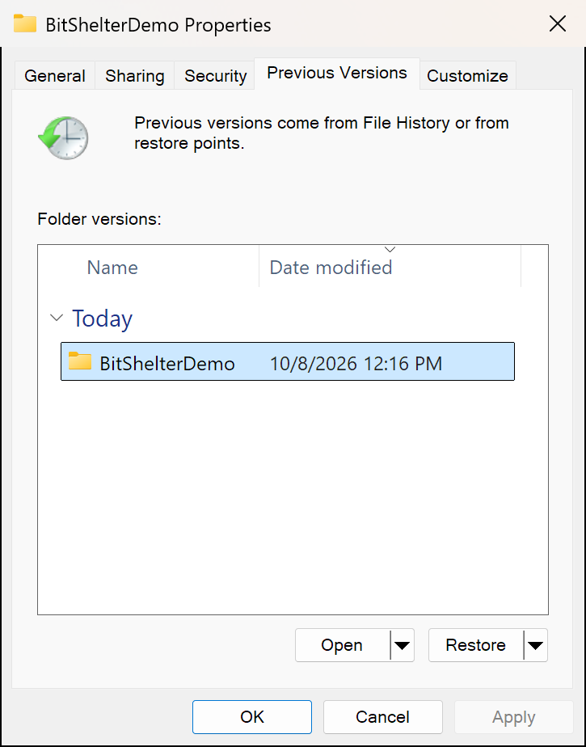
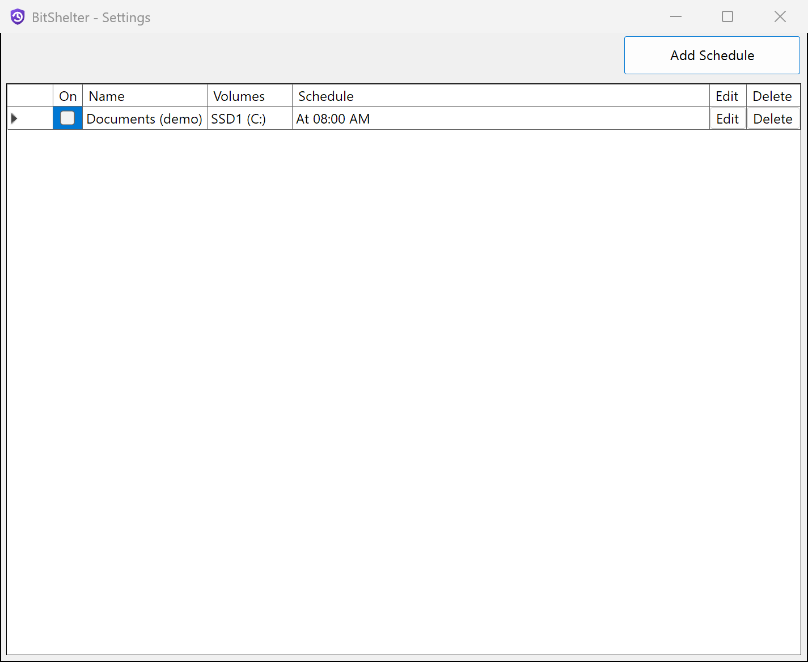

## BitShelter

BitShelter keeps a version history of your files on Windows 11 and backs them up to another drive.

- **Snapshots**: on a schedule, BitShelter takes snapshots of your drives with the Windows Volume Shadow Copy Service (VSS). To get back a deleted file or an earlier version, open **Previous Versions** in File Explorer. Snapshots are fast and use little disk space.
- **Backups**: after a snapshot, BitShelter can copy selected folders from the snapshot to another drive, a network share, or a cloud sync folder. Backups can be zip or tar archives, encrypted with OpenPGP.

Earlier versions in File Explorer | Rules in BitShelter Agent
:---:|:---:
 | 

Alexis Incogito created BitShelter in 2018 ([original repository](https://github.com/alexis-/BitShelter)). This repository continues it on .NET 10 and Windows 11. See [CHANGELOG.md](CHANGELOG.md).

### Get started

You need Windows 11 (x64) and the [.NET 10 Desktop Runtime (x64)](https://dotnet.microsoft.com/download/dotnet/10.0).

1. Download and run the MSI from [Releases](https://github.com/sm18lr88/BitShelter/releases).
2. Start **BitShelter Agent** from the Start menu.
3. Click **Add Schedule**. In the **General** tab, click **Enable other Drive(s)** and turn on System Protection for your drives.
4. Select the drives and click **Create**.

A new rule takes a snapshot every 4 hours and keeps it for 1 week. The [user guide](docs/user-guide.md) explains the setup, the defaults, backups, and troubleshooting.

### Documentation

- [User guide](docs/user-guide.md): install, setup, backups, options, FAQ.
- [ARCHITECTURE.md](ARCHITECTURE.md): how the parts work together.
- [TESTING.md](TESTING.md): automated and manual tests.
- [RELEASING.md](RELEASING.md): how to make a release.

### Security

To report a vulnerability, use [private vulnerability reporting](https://github.com/sm18lr88/BitShelter/security/advisories/new). Do not open a public issue. See [SECURITY.md](SECURITY.md).

### Code signing

Release MSIs are not code-signed, so Windows SmartScreen can show a warning when you run one. The Release workflow builds each MSI on a GitHub-hosted runner from the tagged source code.

### Privacy

This program will not transfer any information to other networked systems unless specifically requested by the user or the person installing or operating it. BitShelter writes backups only to the folders that you select, and sends no telemetry.

### License and credits

BitShelter is released under the [MIT License](LICENSE). All dependencies are open source; [THIRD-PARTY-NOTICES.txt](THIRD-PARTY-NOTICES.txt) lists them with their licenses.

Thanks to Alexis Incogito, who created BitShelter; Peter Palotas for [AlphaVSS](https://github.com/alphaleonis/AlphaVSS), which BitShelter used until version 0.2.0; and @Zelss for the Boot Camp fix.
