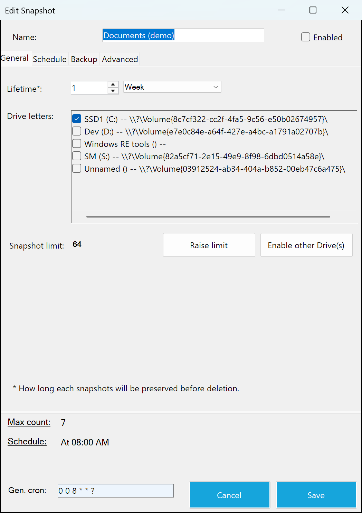
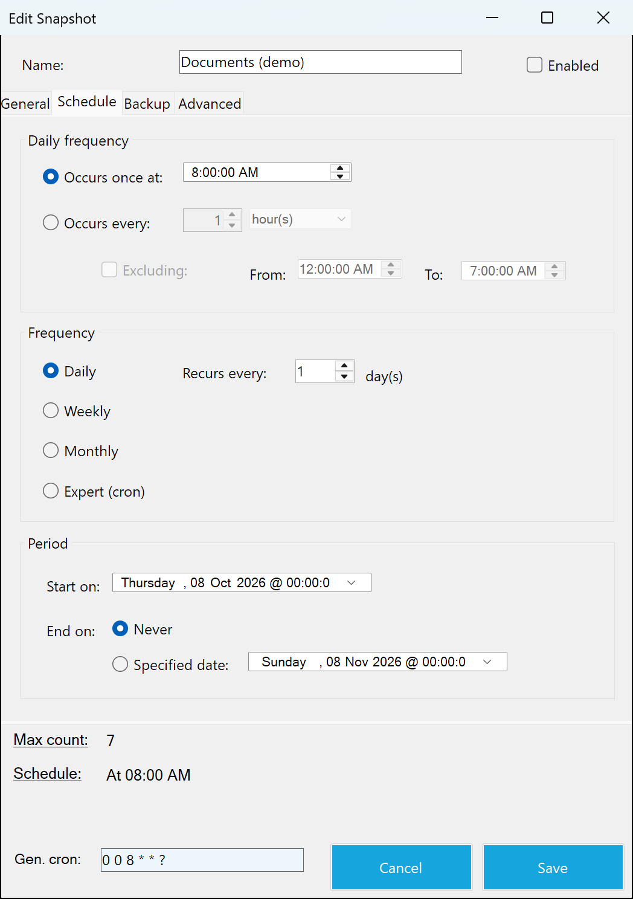
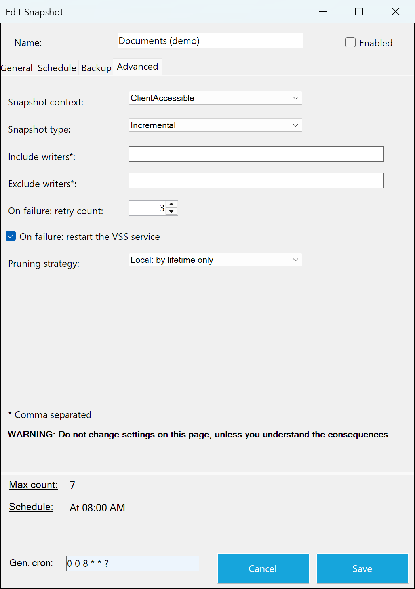
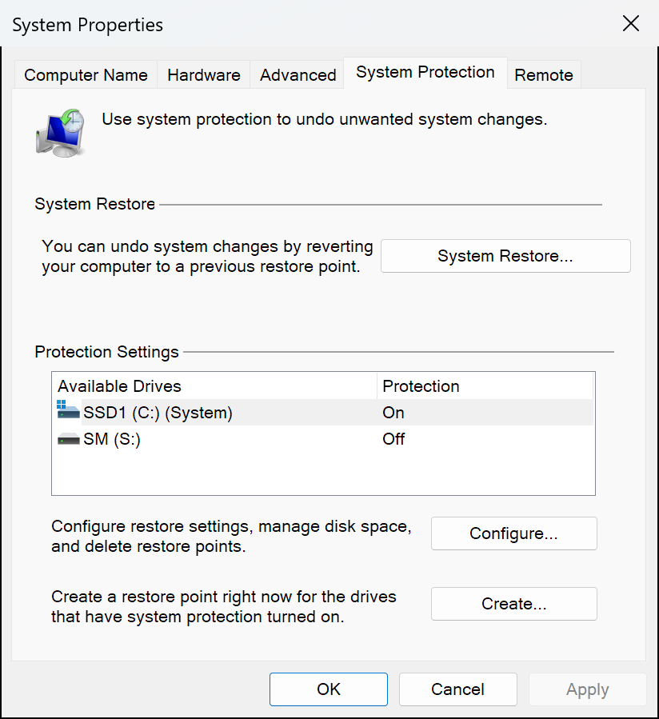
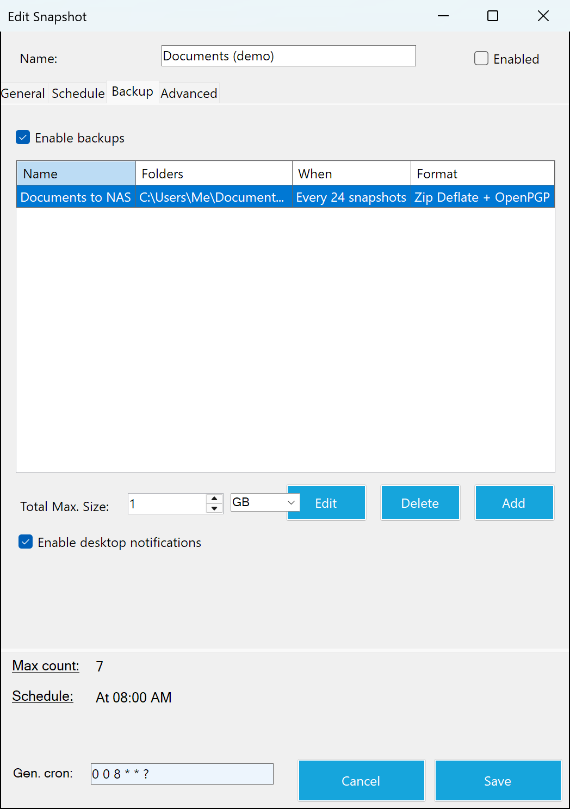
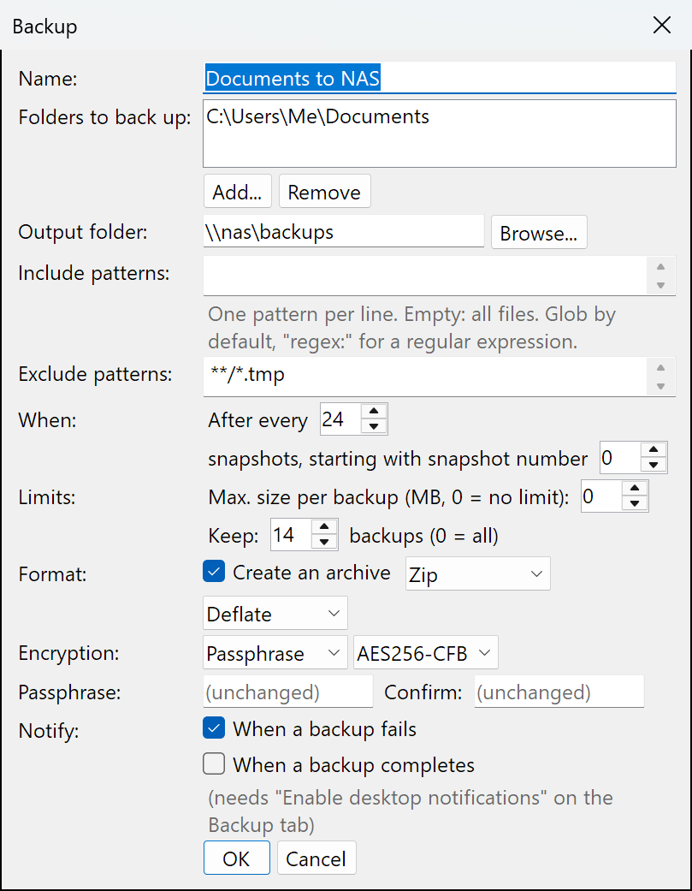
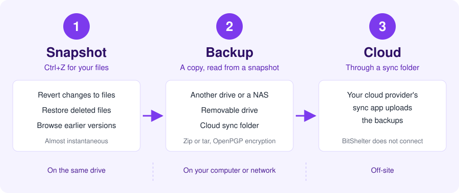
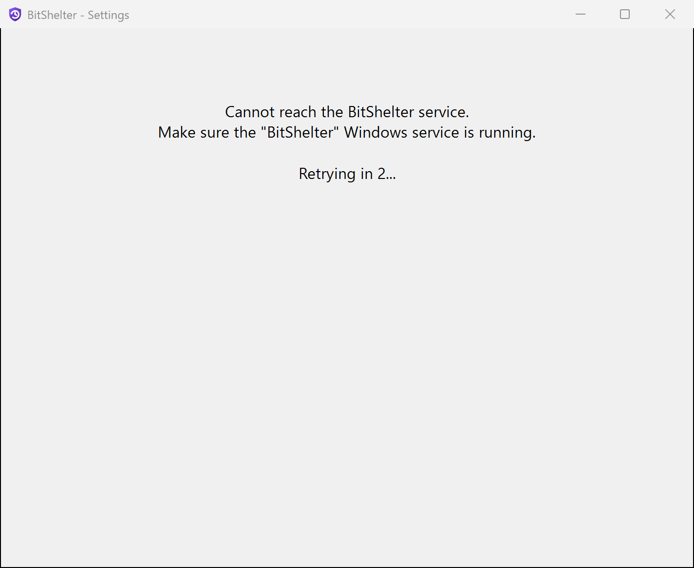

## BitShelter

*BitShelter* is software that uses [Microsoft's VSS technology](https://en.wikipedia.org/wiki/Shadow_Copy) (Volume Shadow Copy Service). It keeps a version history of your files and makes external backups of them.

Did you **delete** a file by mistake? Did you change a document and want to **revert** the **changes**? Did one of your **drives fail**? *BitShelter* helps you in all of these cases.

> [!WARNING]
> BitShelter is currently maintained for **Windows 11** only.

> [!NOTE]
> BitShelter no longer supports older Windows versions.

Alexis Incogito created BitShelter in 2018 ([original repository](https://github.com/alexis-/BitShelter)). This repository continues the project on .NET 10 and Windows 11. See [CHANGELOG.md](CHANGELOG.md) for the changes.

### Table of Contents
- [Screenshots](#screenshots)
- [Features](#features)
- [Limitations](#limitations)
- [How does it work?](#how-does-it-work)
- [Requirements](#requirements)
- [Downloads](#downloads)
- [Installation and Usage](#installation-and-usage)
- [Backups](#backups)
- [Testing](#testing)
- [Architecture](#architecture)
- [Upgrading](#upgrading)
- [Best Practices](#best-practices)
- [FAQ](#faq)
- [Glossary](#glossary)
- [Security](#security)
- [Code signing policy](#code-signing-policy)
- [Privacy](#privacy)
- [Special thanks, Credits, Licenses](#special-thanks-credits-licenses)

### Screenshots

Earlier versions in File Explorer  |  List of rules
:-------------------------:|:-------------------------:
 | 

New rule: General          |  New rule: Schedule
:-------------------------:|:-------------------------:
  |  

New rule: Advanced         |  Windows System Protection
:-------------------------:|:-------------------------:
  |  

New rule: Backup          |  Backup settings
:-------------------------:|:-------------------------:
  |  

### Features

**Snapshots**: Keep a [version history](https://www.howtogeek.com/howto/11130/restore-previous-versions-of-files-in-every-edition-of-windows-7/) of your files.
- Revert changes to files.
- Restore deleted files.
- [Browse your files](Resources/Windows_PreviousVersions.png) as they were at an earlier point in time.
- Use little disk space: snapshots use the [incremental method](https://en.wikipedia.org/wiki/Copy-on-write).
- Short snapshot intervals have a [negligible cost in disk space](https://en.wikipedia.org/wiki/Copy-on-write).
- Capture your files even when [other processes lock them](https://msdn.microsoft.com/en-us/library/windows/desktop/aa384612(v=vs.85).aspx).
- Use a very flexible [scheduling system](Resources/BitShelter.Agent_Schedule.png).

**Backups**: Keep your data safe on other drives or off-site.
- Back up selected folders after a snapshot. BitShelter reads the files from the new snapshot, so the backup is consistent and includes files that other processes lock.
- Save backups on a local drive, a network share, a removable device, or the sync folder of a cloud storage provider (Dropbox, Google Drive, ...).
- Select the files to back up with [Glob](https://github.com/dazinator/DotNet.Glob#patterns) and [Regex](https://www.regular-expressions.info/) patterns.
- Save each backup as a folder copy or as an archive: zip (no compression, deflate, bzip2, PPMd) or tar (no compression, gzip, bzip2, lzip).
- Encrypt archives in the standard [OpenPGP](https://en.wikipedia.org/wiki/Pretty_Good_Privacy) format, with a public key or a passphrase. You decrypt them with [GnuPG](https://gnupg.org/) or Kleopatra. Ciphers: AES128/256, Blowfish, Camellia128/256, CAST5, 3-DES, and Twofish.
- Run a backup after every snapshot, or after every N-th snapshot, with an optional offset.
- Limit the size of each backup, the number of backups that BitShelter keeps, and the total size of the backups of a rule. BitShelter deletes the oldest backups first.
- Get a desktop notification from the Agent when a backup completes or fails.

### Limitations

- A drive can have a maximum of [512 snapshots](https://learn.microsoft.com/en-us/windows/win32/backup/registry-keys-for-backup-and-restore#maxshadowcopies).
- Encryption works only together with archives.
- An encrypted zip archive can be at most 4 GB, because Zip64 needs a seekable output. For larger encrypted backups, use tar.
- BitShelter has no restore function for backups. Restore files with standard tools. See [Backups](#backups).
- If BitShelter cannot read a file or folder during a backup, it skips the item, writes a warning to the log, and continues.
- You must turn on Windows [System Protection](Resources/Windows_SystemProtection.png) manually, one time, on each drive that you want to snapshot. See [Installation and Usage](#installation-and-usage).

If you know a workaround for these limitations, please open an [issue](https://github.com/sm18lr88/BitShelter/issues).

### How does it work?

Operation        |  Result                   |  Location    |  Size        |  Speed
:---------------:|:-------------------------:|:------------:|:------------:|:------------:
**Snapshot**     |  This is *similar* to **Ctrl+Z** for files. Each snapshot records the content of your files at that time. You can [browse, view, and restore](Resources/Windows_PreviousVersions.png) the earlier versions. You can continue to work while a snapshot is created1.  |  Same drive as the data  |  The size of the changes between two consecutive snapshots  |  Almost instantaneous
**Backup**       |  This is *similar* to **Ctrl+C** and **Ctrl+V**: a backup is a *copy* of your files. You can store backups locally or remotely. You can also archive them with compression (for example, zip or tar.gz) and encrypt them. Backups read from snapshots, so you can continue to work during a backup1. See [best practices](#best-practices) for recommendations.  |  Local drive, network drive, removable device, ...  |  At most the size of the data. Less if compressed.  |  Minutes to hours. This depends on the size, the disk speed, the compression, and the encryption.
**Cloud sync**   |  *BitShelter* does not connect to cloud storage. To keep copies in the cloud, save your backups in the sync folder of a popular provider. The provider then sends them to your cloud space.  |  In the cloud  |  The same as the backups. It counts only against your cloud storage space.  |  Minutes to hours. This depends on the size and the upload speed.

**1**: A snapshot does not copy the existing data. Windows records where the data is, and writes new data to free space. This is very fast. Programs can read a snapshot while the live data continues to change. For more information, see [Copy-on-write](https://en.wikipedia.org/wiki/Copy-on-write).

### Requirements

- **Windows 11 (x64)** only.
- **System Protection** turned on for each drive that you want to snapshot. See [Installation and Usage](#installation-and-usage).
- To run the service and the Agent: **.NET 10 Desktop Runtime (x64)**.
- To build from source: **.NET 10 SDK**. `global.json` pins the SDK version. Visual Studio 2026 is optional.
- Administrator rights: the Agent asks for elevation (UAC). The Agent talks to the service over a named pipe, and only administrators can use this pipe.

### Downloads

[**All releases**](https://github.com/sm18lr88/BitShelter/releases)

A release can be older than the current source code. To get the latest code, build it from source.
Releases from the original 2018 repository are not in this repository.

> [!IMPORTANT]
> **Follow the instructions** about ***System Protection*** and ***Raise limit***. See [Installation and Usage](#installation-and-usage).

### Installation and Usage

BitShelter has two parts:

- **BitShelter service**: a Windows service that runs in the background as LocalSystem. It starts with Windows. It creates and prunes the snapshots, and makes the backups. If it fails, Windows restarts it. It does not need the Agent to run.
- **BitShelter Agent**: an elevated tray app. You use it to create and edit the snapshot rules and their backups. It shows backup notifications. Its tray menu has the **Run at startup** option. This option starts the Agent elevated when you sign in, through a scheduled task. You do not see a UAC prompt.

#### With the installer (recommended)

1. Install the **.NET 10 Desktop Runtime (x64)**. If it is missing, the installer shows a message and stops.
2. Run `BitShelter-<version>-x64.msi`. The installer does these steps:
   - It installs the files to `C:\Program Files\BitShelter`.
   - It registers and starts the `BitShelter` service.
   - It adds **BitShelter Agent** to the Start menu.
3. Start **BitShelter Agent** from the Start menu.

When you uninstall BitShelter, the installer removes the service, the files, and the startup task of the Agent. It keeps your settings and logs in `%ProgramData%\BitShelter`. It also keeps your existing snapshots.
If the Agent is running, the installer closes it before an upgrade or an uninstall.

To build the installer, run `dotnet build .\BitShelter.Setup -c Release`. The build publishes the service and the Agent first. It writes the MSI to `BitShelter.Setup\bin\x64\Release\`.

#### From source, without the installer

1. Open an elevated shell. Build and test:
   - `dotnet build .\BitShelter.slnx -c Release`
   - `dotnet test --solution .\BitShelter.slnx -c Release`
2. Publish (x64):
   - `dotnet publish .\BitShelter.Service\BitShelter.Service.csproj -c Release -r win-x64 --self-contained false -o .\artifacts\service`
   - `dotnet publish .\BitShelter.Agent\BitShelter.Agent.csproj -c Release -r win-x64 --self-contained false -o .\artifacts\agent`
3. Install the service (admin PowerShell):
   - `sc.exe create BitShelter binPath= "C:\full\path\to\artifacts\service\BitShelter.Service.exe" start= auto obj= LocalSystem`
   - `sc.exe failure BitShelter reset= 86400 actions= restart/60000/restart/60000/restart/60000`
   - `sc.exe start BitShelter`
4. Run the Agent: `.\artifacts\agent\BitShelter.Agent.exe`

#### Configure System Protection and create a schedule

1. Double-click the **BitShelter** icon in the notification area of the taskbar: 
2. In the [Main Window](Resources/BitShelter.Agent_Rules.png), click the **Add Schedule** button.
    * In the [General tab](Resources/BitShelter.Agent_General.png), click **Enable other Drive(s)**.
    * In the [System Protection dialog](Resources/Windows_SystemProtection.png), select the necessary drives and click **Configure**.
    * In the [new dialog](Resources/Windows_SystemProtectionConfigure.png), click **Turn on system protection**. Select the disk space to reserve for snapshots. Click **OK**.
    * In the [General tab](Resources/BitShelter.Agent_General.png), click **Raise limit**. Set the new limit to **512**. The Windows default is 64.
    * In the [General tab](Resources/BitShelter.Agent_General.png), select the **Drive letters** and the **Lifetime**.
    * In the [Schedule tab](Resources/BitShelter.Agent_Schedule.png), set the schedule of your snapshots.
    * Click the **Create** button.
    * To make sure that your settings are correct, open the **Previous Versions** tab of a folder on a selected drive, and [verify the snapshots](Resources/Windows_PreviousVersions.png).

#### Backups

Prerequisites: the rule must snapshot the drive of each folder that you want to back up, because the backup reads the files from the snapshot.

1. In the rule editor, open the **Backup** tab.
2. Select **Enable backups**.
3. Click **Add**. In the **Backup** dialog:
    * Type a **Name**.
    * Add the **Folders to back up**.
    * Select an **Output folder**. It must not be inside a folder to back up.
    * Optionally, type **Include patterns** and **Exclude patterns**, one pattern per line. If there is no include pattern, BitShelter includes all files. A pattern is a glob, for example `**/*.docx`. To use a regular expression, start the line with `regex:`.
    * In **When**, set after how many snapshots a backup runs, and the number of the first snapshot that gets a backup. Snapshot numbers start at 0 when you enable backups.
    * In **Limits**, set the maximum size of one backup and the number of backups to keep. 0 means no limit.
    * In **Format**, select **Create an archive** and the archive type, or clear it to copy the files into a folder.
    * In **Encryption**, select **Public key** or **Passphrase**, and the cipher. Both make a standard OpenPGP file. Paste or load the OpenPGP public key, or type the passphrase two times (at least 8 characters).
    * Click **OK**.

    
4. Optionally, set **Total Max. Size** for all backups of the rule, and select **Enable desktop notifications**.
5. Click **Create** or **Save**.

Each backup goes to `<output folder>\<rule name> - <backup name>\<yyyyMMdd-HHmmss><extension>`, for example `D:\Backups\Daily - Documents\20261008-140000.zip.gpg`. BitShelter writes a backup under a `.partial` name first, and renames it only when it is complete.

> [!WARNING]
> Keep your OpenPGP private key or your passphrase in a safe place that is not on the backed-up computer. Without them, nobody can decrypt the backups.

> [!CAUTION]
> The service runs as LocalSystem, so it can read files that other users cannot read. A backup file gets the permissions of its output folder. Select an output folder that only trusted users can read, or use encryption.

To restore files from a backup:

- Folder copy: copy the files back from the backup folder.
- Zip archive: open it in File Explorer or 7-Zip.
- Tar archive: run `tar -xf <file>` (Windows 11 includes `tar`).
- Encrypted archive: run `gpg --decrypt-files <file>.gpg` to get the archive, then extract it.

The Agent stores a backup passphrase protected with DPAPI (local machine scope). The plain passphrase does not go to disk or over the named pipe. Because any process on the computer can unprotect it, the service lets only SYSTEM and Administrators read `%ProgramData%\BitShelter`.

#### Advanced options

- **On failure: retry count**: the number of times that the service tries a failed snapshot again, one minute apart.
- **Pruning strategy**:
    - **Local**: the service deletes the snapshots of the rule only when they are older than the **Lifetime**.
    - **Global** (default for new rules): also, before each snapshot, if a drive is at its snapshot limit, the service deletes the oldest snapshot of this rule on that drive. Without this option, VSS deletes the oldest snapshot of the drive, which can be a System Restore point or a snapshot of another rule. Rules from earlier versions use **Local**.
- **On failure: restart the VSS service**: before each retry, the service restarts the Volume Shadow Copy (`VSS`) service. A VSS service in a bad state is a common cause of repeated snapshot failures. Other programs that use VSS at that time can fail.

### Testing

- Automated tests: `dotnet test --solution .\BitShelter.slnx -c Release`
- Coverage report: see [TESTING.md](TESTING.md).
- Manual validation that needs administrator rights (VSS, service lifecycle, UI): see [TESTING.md](TESTING.md).

### Architecture

[ARCHITECTURE.md](ARCHITECTURE.md) describes the components, the named-pipe protocol and its security boundary, the state files, and the scheduling.

### Upgrading

*BitShelter* cannot update itself yet.

- If you installed with the MSI: run the new MSI. It replaces the earlier version in place. This includes installs from the 2018 installer.
- If you installed manually: stop the `BitShelter` service, replace the published files, and then start the service again.

An upgrade keeps all your settings, snapshots, and logs. The service keeps the 10 most recent `rule_*.json` files in `%ProgramData%\BitShelter` and deletes older ones.

From version 0.2.0, the service changes the permissions of `%ProgramData%\BitShelter` when it starts: only SYSTEM and Administrators can access it. The service also ignores a rule or state file that SYSTEM or the Administrators group does not own, and writes a warning to the log. If you copy a rule file into the folder by hand, make the Administrators group its owner: `icacls <file> /setowner *S-1-5-32-544`.

### Best practices

Rule of thumb: the [3-2-1 Backup Rule](https://www.acronyms-it.co.uk/blog/backup-rule-of-three/). Keep 3 copies of your data, on 2 different types of storage, and 1 copy off-site.

For your local disks:
- Prefer *redundant disk storage*, such as [RAID 1 or 5](https://www.maketecheasier.com/set-up-raid-windows/).
- Use disks from [different batches or brands](https://www.ssrc.ucsc.edu/papers/paris-storagess06.pdf).
- Use an *automatic* solution: set it and forget it.
- Ask yourself what happens if your device fails:
    - Can you recover your files now?
    - Which data do you lose?
    - Is this data important?

Here are three introductory guides to data safety:

- How-To Geek: [What's the best way to back-up my computer ?](https://www.howtogeek.com/242428/whats-the-best-way-to-back-up-my-computer/)
- PCMag: [The Beginner's Guide to PC Backup](https://www.pcmag.com/article2/0,2817,2363057,00.asp)
- MakeUseOf: [Windows 10 data backup guide](https://www.makeuseof.com/tag/ultimate-windows-10-data-backup-guide/)

### FAQ

- *Is VSS safe?*

Some older posts (2010-2014) report problems with VSS. The list below gives these reports.

As of 2018-05-05, the original author had used *BitShelter* for more than one month on Windows 10 version 1709. The author did not see any of these problems. Several attempts to reproduce them in different environments did not succeed.

[Snapshot corruption: restored files are damaged](https://answers.microsoft.com/en-us/windows/forum/windows8_1-files/shadow-copy-snapshot-file-contents-silently/06a5e25b-6607-45eb-81a1-71cfc2b0cce3?tm=1431093840771)

- *How do I start the Agent at startup?*

The service starts with Windows, so *BitShelter* stays active when the *Agent* is stopped.
To start *BitShelter Agent* automatically when you sign in:
1. Run the *Agent*.
2. Right-click its **Tray Icon**.
3. Make sure that **Run at startup** is checked.

- *Problems when you run Windows on a Mac with Boot Camp*

You can fix most of these problems with [this guide](https://www.edandersen.com/2015/07/06/windows-10-on-mac-bootcamp-fixes/) (section *System Restore, Restore Points and Windows 7 style backups do not work*).

- *The Agent cannot connect to the service. What do I do?*

The Agent shows "Cannot reach the BitShelter service". Older versions show "Connection to the service failed".

1. Make sure that the **BitShelter** service is running. Open **Services** (`services.msc`) and find **BitShelter**, or run `Get-Service BitShelter` in PowerShell. Its status must be **Running**.
2. Make sure that the Agent runs as administrator. The service accepts connections only from administrators.

### Glossary

- **Agent**: the BitShelter tray app (`BitShelter.Agent.exe`). You use it to create, edit, and delete rules.
- **Backup**: a copy of files from a snapshot to a different location, as a folder copy or an archive.
- **Backup rule**: the settings of one backup of a rule: folders, output folder, patterns, frequency, limits, format, and encryption. A rule can have several backup rules.
- **Lifetime**: the time for which the service keeps the snapshots of a rule. After this time, the service prunes them.
- **Pruning**: the deletion of snapshots that are older than the lifetime of their rule. The service checks every minute. With the **Global** pruning strategy, the service also deletes the oldest snapshot of a rule when a drive is at its snapshot limit.
- **Rule**: a set of drives, a schedule, and a lifetime. The service creates snapshots for each enabled rule. The Agent also uses the word "schedule" (for example, the **Add Schedule** button).
- **Service**: the `BitShelter` Windows service (`BitShelter.Service.exe`). It runs the rules.
- **Snapshot** (also *shadow copy*): a read-only copy of a drive at one point in time. VSS creates it.
- **System Protection**: the Windows setting that reserves disk space for snapshots on a drive.
- **VSS** (Volume Shadow Copy Service): the Windows component that creates and stores snapshots.

### Security

To report a vulnerability, use [private vulnerability reporting](https://github.com/sm18lr88/BitShelter/security/advisories/new) on GitHub. Do not open a public issue. See [SECURITY.md](SECURITY.md).

### Code signing policy

Signed releases use free code signing provided by [SignPath.io](https://about.signpath.io/), certificate by [SignPath Foundation](https://signpath.org/).

- Committers and reviewers: [sm18lr88](https://github.com/sm18lr88)
- Approvers: [sm18lr88](https://github.com/sm18lr88)

The release workflow builds the MSI on GitHub-hosted runners from the tagged source code. An approver must approve each signing request.

> [!NOTE]
> Until SignPath Foundation accepts the project, the release MSI is not signed. Windows SmartScreen can then show a warning when you run it.

### Privacy

This program will not transfer any information to other networked systems unless specifically requested by the user or the person installing or operating it.

BitShelter writes backups only to the output folders that you configure. It sends no telemetry.

### Special thanks, Credits, Licenses

*BitShelter* is built on the work of people who give their time to the open-source community. The project thanks them all, and especially:
* *Alexis Incogito*, who created *BitShelter*.
* *Peter Palotas* for his **incredible** [AlphaVSS](https://github.com/alphaleonis/AlphaVSS) (the central part of *BitShelter*).
* *@Zelss* for finding how to configure Boot Camp.

BitShelter is released under the [MIT License](LICENSE).

BitShelter uses only open-source dependencies and build tools. [THIRD-PARTY-NOTICES.txt](THIRD-PARTY-NOTICES.txt) lists each component that the installer ships, with its copyright and license, and the full license texts. The installer also installs this file. `Directory.Packages.props` lists the NuGet packages and their versions.

If a license notice is missing or wrong, please open an [issue](https://github.com/sm18lr88/BitShelter/issues).
